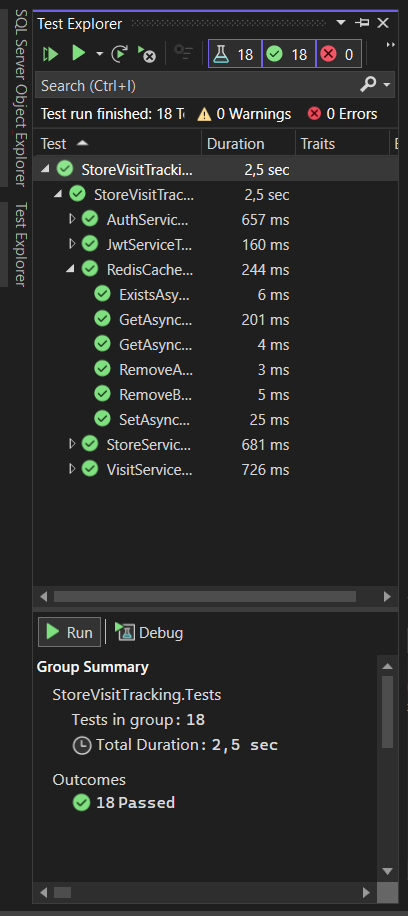
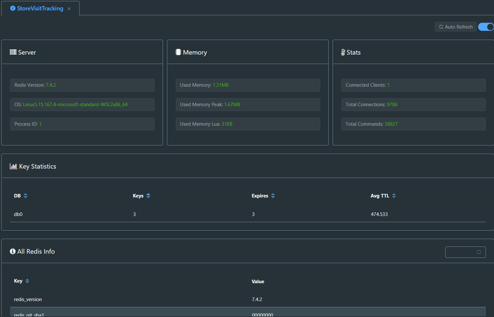
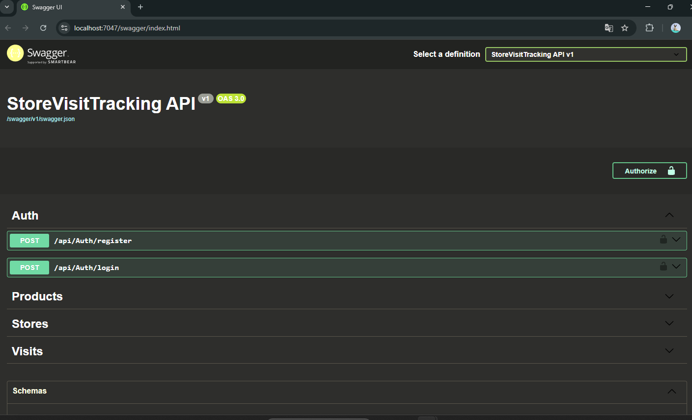

# Store Visit Tracking

Bu proje, mağaza ziyaretlerinin takibini sağlayan bir web uygulamasıdır. .NET 8.0 kullanılarak geliştirilmiştir.

## Gereksinimler

- .NET 8.0 SDK
- Visual Studio 2022 veya Visual Studio Code
- MySQL Server
- Redis Server
- Git

## Kurulum

1. Projeyi klonlayın:
```bash
git clone [repository-url]
cd StoreVisitTracking
```

2. MySQL veritabanını kurun:
   - MySQL Server'ı yükleyin
   - MySQL Workbench'i yükleyin (veritabanı yönetimi için)
   - Aşağıdaki adımları izleyin:

   a. Veritabanını oluşturun:
   ```sql
   CREATE DATABASE storevisittrackingdb;
   CREATE USER 'root'@'localhost' IDENTIFIED BY 'root';
   GRANT ALL PRIVILEGES ON storevisittrackingdb.* TO 'root'@'localhost';
   FLUSH PRIVILEGES;
   ```

   b. Veritabanı şemasını ve verileri import edin:
   - MySQL Workbench'i açın
   - Sol menüden "Data Import/Restore" seçeneğini seçin
   - "Import from Self-Contained File" seçeneğini seçin
   - Bu linkten db'yi indirin: https://drive.google.com/file/d/1Gziu8Ecb61Tuf5UhXX7Re8jirfuGxqH1/view?usp=drive_link
   - "Browse" butonuna tıklayıp indirdiğiniz dosyayı seçin
   - "Start Import" butonuna tıklayın
   - Import işleminin tamamlanmasını bekleyin

   c. Veritabanı bağlantısını test edin:
   ```sql
   USE storevisittrackingdb;
   SELECT COUNT(*) FROM Users;
   SELECT COUNT(*) FROM Stores;
   SELECT COUNT(*) FROM Visits;
   SELECT COUNT(*) FROM Products;
   SELECT COUNT(*) FROM Photos;
   ```

3. Redis'i kurun:
   - Redis Server'ı yükleyin
   - Redis servisinin çalıştığından emin olun

4. Projeyi Visual Studio'da açın:
   - `StoreVisitTracking.sln` dosyasını açın
   - NuGet paketlerinin yüklenmesini bekleyin

5. Veritabanı bağlantı ayarlarını kontrol edin:
   - `appsettings.json` dosyasında bağlantı bilgilerinin doğru olduğundan emin olun
   - Varsayılan bağlantı bilgileri:
     - Sunucu: localhost
     - Port: 3306
     - Veritabanı: storevisittrackingdb
     - Kullanıcı adı: root
     - Şifre: root

6. Projeyi çalıştırın:
   - Visual Studio'da F5 tuşuna basın veya
   - Terminal'de aşağıdaki komutu çalıştırın:
   ```bash
   dotnet run --project StoreVisitTracking.API
   ```

## Uygulamaya Erişim

Uygulama aşağıdaki URL'ler üzerinden erişilebilir:
https://localhost:7047/swagger

- Önemli not swaggerda authorize olmak için loginden dönen tokeni sağ üst kısımdaki Authorize butonuna yapıştırmanız gerekmektedir.

## Test

Projeyi test etmek için:
```bash
cd StoreVisitTracking.Tests
dotnet test
```

### Test Sonuçları
✅ Tüm testler başarıyla çalışıyor (18 test)

#### Unit Test Sonuçları


#### Redis Cache Test Sonuçları


#### Swagger UI


## Sorun Giderme

1. Veritabanı bağlantı sorunları:
   - MySQL servisinin çalıştığından emin olun
   - Bağlantı bilgilerini kontrol edin
   - Veritabanının oluşturulduğundan emin olun
   - SQL dosyasının başarıyla import edildiğinden emin olun
   - Verilerin doğru import edildiğini kontrol edin

2. Redis bağlantı sorunları:
   - Redis servisinin çalıştığından emin olun
   - Redis'in varsayılan port (6379) üzerinden erişilebilir olduğunu kontrol edin

3. Port çakışması yaşanırsa:
   - `appsettings.json` dosyasındaki port numaralarını değiştirin
   - Kullandığınız portların başka uygulamalar tarafından kullanılmadığından emin olun

## Katkıda Bulunma

1. Bu repository'yi fork edin
2. Yeni bir branch oluşturun (`git checkout -b feature/amazing-feature`)
3. Değişikliklerinizi commit edin (`git commit -m 'Add some amazing feature'`)
4. Branch'inizi push edin (`git push origin feature/amazing-feature`)
5. Pull Request oluşturun

## Lisans

Bu proje [MIT lisansı](LICENSE) altında lisanslanmıştır.

